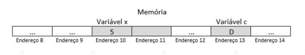

# Estruturas de Dados Heterogêneas

### Módulo 1
### Empregar ponteiros com a utilização da linguagem de programação C

#### Ponteiro

Na linguagem C, cada variável tem um nome, um tipo, um valor e um endereço.

```
int x = 5;  
char c = 'D';
```

Temos que o nome da variável é "x", o tipo é inteiro, o valor é 5 e essa variável está armazenada na memória no endereço 10. A variável "x" usa dois bytes de memória e quando um objeto usa mais de um byte, seu endereço é onde ele começa. no caso, 10.

Assim como o nome da outra variável é "c", o tipo char, o valor "D", está armazenada no endereço de memória 13 e usa um byte de memória.




#### Structs em C

Para acessar os membros (campos, elementos) de uma estrutura de dados `struct` podem ser utilizados dois tipos de operadores:

- Operador de membro de estrutura **.** (operador de ponto ou de seleção direta)
- Operador de ponteiro de estrutura **->** (operador de seta)

Quando é declarada uma variável do tipo estrutura, acessamos um membro (campo) da estrutura usando o operador ponto, indicando o nome da estrutura, seguido por um ponto e pelo nome do campo que se quer acessar.

Neste caso dizemos que a estrutura é **diretamente referenciada**.

Podemos acessar e visualizar o campo rua da estrutura x (que é uma variável endereco), usando a seguinte declaração:

```
printf("%s", x.rua);
```

Quando a struct for referenciada através de ponteiros, o emprego é semelhante ao operador ponto, sendo este substituído pelo operador seta (**->**).

Suponha que um ponteiro **xptr** tenha sido declarado e aponte para a estrutura endereco, e que o endereço de uma estrutura **x** tenha sido atribuído ao ponteiro xptr.

Para acessar o membro rua da estrutura endereco via operador de ponteiro, usamos a declaração a seguir:

```
printf("%s", x -> rua);
```

#### Manipulando structs

```
/* Ficha de Aluno */
#include <stdio.h>
#include <conio.h>

int main(void)
{
    /* Criando a struct */
    
    struct ficha_de_aluno
    {
        char nome[50];
        char disciplina[30];
        float nota_prova1;
        float nota_prova2;
    };

    /* Criando a variáelaluno que será tipo struct ficha_de_aluno */

    struct ficha_de_aluno aluno;

    printf("/n---------- Cadastro de aluno ----------\n\n\n");
    printf("Nome do aluno ......: ");
    fflush(stdin);
    fgets(aluno.nome, 40, stdin);
    printf("Disciplina ......: ");
    fflush(stdin);
    fgets(aluno.disciplina, 40, stdin);
    printf("Informe a 1a. nota ..: ";
    scanf("%f", &aluno.nota_prova1);
    printf("Informe a 2a. nota ..: ");
    scanf("%f", &aluno.nota_prova2);
    printf("\n\n ---------- Lendo os dados da struct ----------\n\n");
    printf("Nome ...........: %s", aluno.nome);
    printf("Disciplina .....: %s", aluno.disciplina);
    printf("Nota da Prova 1 ...: %.2f\n", aluno.nota_prova1);
    printf("Nota da Prova 2 ...: %.2f\n", aluno.nota_prova2);
    getch();
    return(0);
}
```

`Função fgets()`

A função fgets() tem o objetivo de ler string, no caso o nome do aluno e a disciplina.

```
fgets(variavel, tamanho da string, entrada
```

Neste caso a entrada é stdin (entrada padrão), pois estamos lendo do teclado.

```
fgets(aluno.nome, 40, stdin);

fgets(aluno.disciplins, 40, stdin);
```

