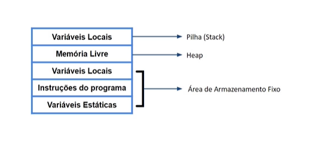

# Linearidade X Não Linearidade

## Alocação

- Quando criamos uma variável basicamente reservamos (alocamos) um local na memória RAM para essa variável.
- Cada tipo de dado demanda um determinado espaço para que a variável seja colocada em memória.

## Alocação em C

char: 1 byte  
int: 4 bytes  
float: 4 bytes  
double: 8 bytes  

## Alocação em memória RAM

- Como um programa é alocado em memória?
- Como variáveis são alocadas em memória?
- Dados são todos alocados continuamente?
- Alocação é estática ou dinâmica?

Em linguagens de **alto nível** utilizamos estruturas e **não nos importamos** de que forma nossos dados são armazenados fisicamente.

#### Como um programa é alocado em memória?

Quando um programa vai ser executado, o sistema operacional é responsável por alocar um espaço em memória para que o programa seja colocado lá.

Para que o processador possa usar o programa a primeira premissa é que o programa esteja em memória RAM.

Quando iniciamos um programa ele precisa ser copiado do HD, onde é apenas código, memória estática, pelo sistema operacional, para a memória RAM. Só assim quando o processador for executar o programa possa ter acesso a ele. O processador não execta coisas quando se está em disco.

O processador, via sistema operacional, busca no HD o código do programa e faz uma
cópia para a memória RAM. Após estar na memória RAM ele se torna uma entidade dinâmica e não mais estática.

O programa é alocado pelo sistema operacional na memória RAM.

#### Como as variáveis são alocadas na memória RAM?

O programa vai ter um espaço alocado para variáveis na memória RAM. Podem ser alocadas de forma contínua, de forma não contínua. Podem ser alocadas estaticamente, dinamicamente. Temos diferenças nas formas como as variáveis são alocadas.

#### Dados são todos alocados continuamente?

Alocação pode ser contínua ou não contínua. Por exemplo o array, vetor, é alocado continuamente, cada posição de memória está uma do lado da outra.

Se tenho um vetor de 4 posições, teremos os índices 0, 1, 2, 3 um ao lado do outro:

| 0 | 1 | 2 | 3 |
|---|---|---|---|
| posição 1 | posição 2 | posição 3 | posição 4 |

Na alocação não contínua podemos alocar os elementos em diferentes partes da memória e accessá-los por meio de ponteiros, que são variáveis que contém um endereço de memória aonde esteja o elemento (dado) que queremos acessar.

#### Alocação é estática ou dinâmica?

Estática é quando eu tenho dados que são alocados estaticamente, desde o início do programa.

Dinâmica é alocada sob demanda, em tempo de execução.

## Alocação de memória RAM

O programa vai ter várias partes onde vamos poder alocar em cada parte coisas diferentes.

Na base vamos ter a área de armazenamento fixo, asvariáveis já existem e estão alocadas, ela é de um determinado tipo e já está alocada na memória. O valor da variável pode mudar o que não muda é a sua estrutura.

Outras 2 partes são a memória livre (Heap) e as variáveis locais (Pilha - Stack).

As funções podem declarar variáveis locais e podem receber parâmetros.

As variáveis locais dentro de uma função só existem enquanto a função estiver sendo executada.

## Alocação em memória

### O que é melhor?

- Alocar continuamente todos os dados do meu programa?
- Ou alocar dinamicamente conforme demanda?

Resposta: Depende. Tem que avaliar o problema.

Se sabemos de antemão todos os elementos que vamos utilizar podemos alocar continuamente.
Se não sabemos se vamos precisar de mais memória, é melhor alocar dinamicamente.
